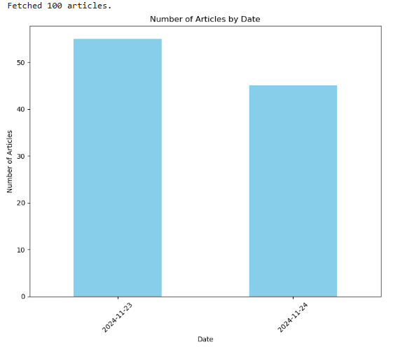
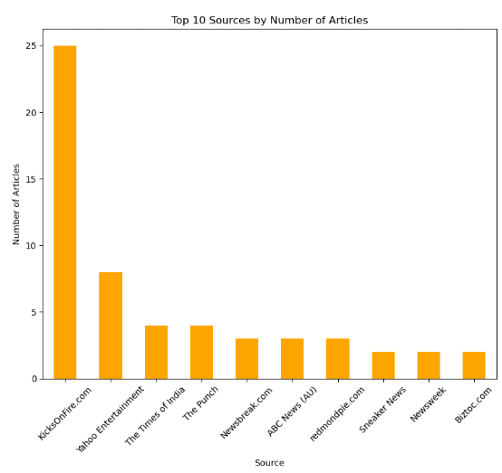
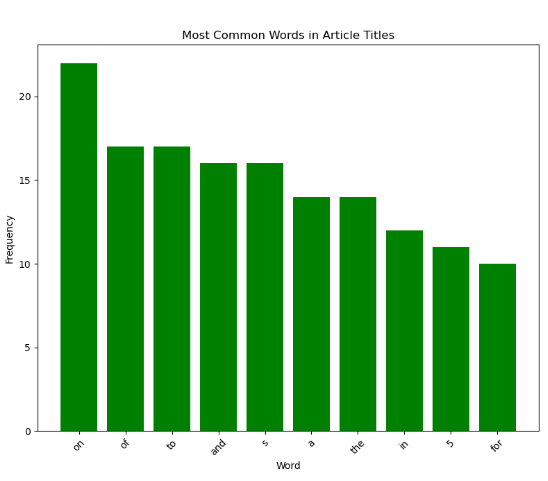
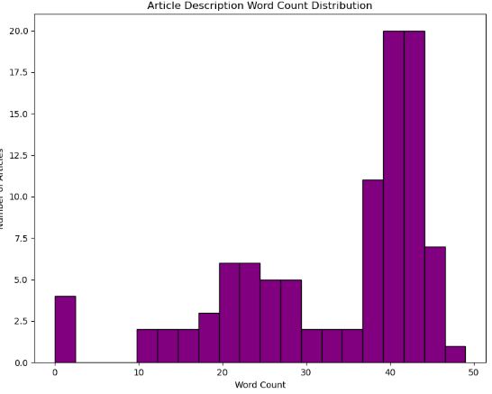
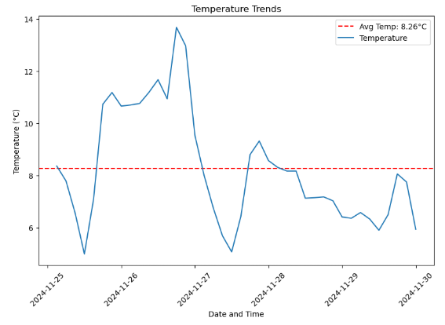
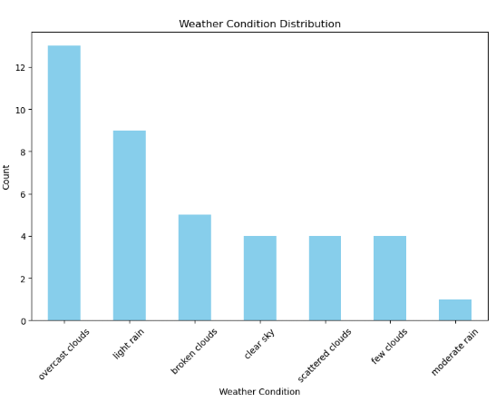
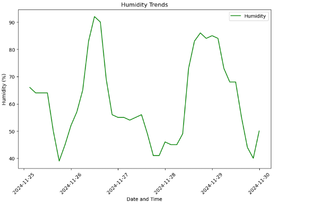
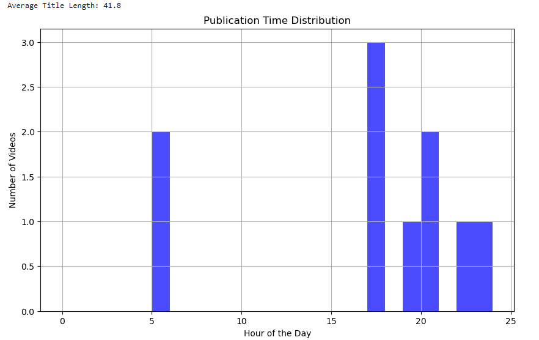
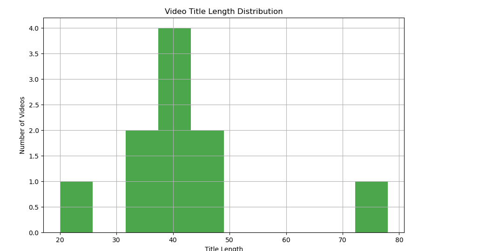
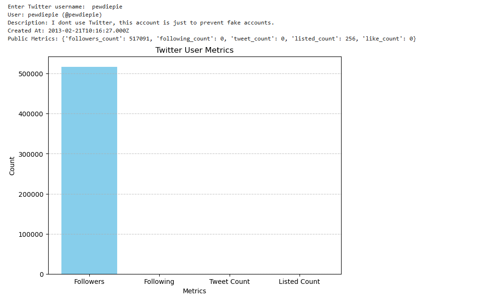

React API Integration App
This project is a React-based web application that demonstrates the integration of multiple APIs for various functionalities, including fetching news, tweets, YouTube videos, and weather information. The app is designed to showcase how to perform API calls using React and manage data effectively within a front-end application.

🚀 Features
News Fetching: Retrieve and display the latest news from a public API.
Twitter Integration: Search for and display tweets from Twitter's API.
YouTube Video Search: Search for videos on YouTube and show the results.
Weather Updates: Fetch and display weather data based on location.
🛠️ Technologies Used
React: A JavaScript library for building user interfaces.
Axios: For making HTTP requests to APIs.
CSS: For styling the application.
JavaScript (ES6+): For logic and interactivity.
APIs Used:
News API
Twitter API (v2)
YouTube API
OpenWeatherMap API (or your chosen weather API)
⚙️ Installation
Prerequisites
Ensure you have the following installed on your system:

Node.js (v14 or higher)
npm or yarn
Steps
Clone the repository:

bash
Copy code
git clone https://github.com/your-username/react-api-integration.git
Navigate to the project directory:

bash
Copy code
cd react-api-integration
Install dependencies:

bash
Copy code
npm install
Create a .env file in the root of your project and add your API keys:

env
Copy code
REACT_APP_NEWS_API_KEY=your-news-api-key
REACT_APP_TWITTER_BEARER_TOKEN=your-twitter-api-key
REACT_APP_YOUTUBE_API_KEY=your-youtube-api-key
REACT_APP_WEATHER_API_KEY=your-weather-api-key
Start the development server:

bash
Copy code
npm start
Open your browser and visit http://localhost:3000.

📂 Project Structure
plaintext
Copy code
react-api-integration/
├── public/
│   ├── index.html
│   └── ...
├── src/
│   ├── components/
│   │   ├── News.js       # News component
│   │   ├── Twitter.js    # Twitter component
│   │   ├── YouTube.js    # YouTube component
│   │   ├── Weather.js    # Weather component
│   │   └── ...
│   ├── App.js            # Main app component
│   ├── index.js          # Entry point
│   ├── styles.css        # Global styles
│   └── ...
├── .env                  # Environment variables (not committed)
├── package.json
└── README.md
server/
|-- server.js

🌐 API Integration Details
News API: Fetches the latest news articles.
Twitter API: Retrieves tweets based on search terms or hashtags.
YouTube API: Allows users to search for YouTube videos.
Weather API: Provides real-time weather information for the searched location.
📸 Screenshots

Data analysis visualization:

NEWS API:

Weather API:

Youtube API:

Twitter API:

🤝 Contributing
Contributions are welcome! Follow these steps:

Fork the project.
Create your feature branch (git checkout -b feature/YourFeature).
Commit your changes (git commit -m 'Add your feature').
Push to the branch (git push origin feature/YourFeature).
Open a pull request.
📝 License
This project is licensed under the MIT License.

📧 Contact
For any inquiries, feel free to reach out:

Email: suhas@gmail.com
GitHub: suhas guntapally
